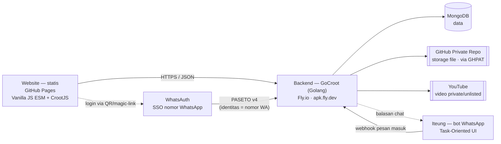
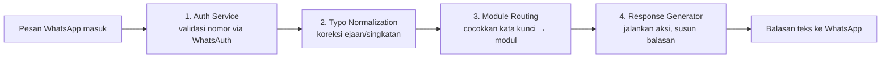

# PDB : Platform Digital Bandung

**LMS (Learning Management System) dengan arsitektur biaya-infrastruktur mendekati nol**,
dibangun di atas layanan gratis/nyaris-gratis dari GitHub, tanpa server, tanpa VM,
dan tanpa biaya storage/CDN tambahan.

Live di **https://platform.digitalbdg.ac.id** — deploy otomatis lewat GitHub Pages
setiap kali ada perubahan di branch `main`.

**Daftar isi:** [Ringkasan Untuk Investor](#ringkasan-untuk-investor) ·
[Arsitektur](#arsitektur) · [Proses Bisnis: Model Penyampaian](#proses-bisnis-model-penyampaian) ·
[Task-Oriented UI — Peta Tugas](#task-oriented-ui--peta-tugas) ·
[Stack Teknologi](#stack-teknologi) ·
[Status Saat Ini](#status-saat-ini) · [Roadmap](#roadmap)

## Ringkasan Untuk Investor

Model bisnis LMS konvensional terbebani biaya infrastruktur yang naik sejalan
jumlah pengguna: server aplikasi, storage file tugas/video, CDN, dan database
terkelola. PDB dirancang untuk **memutus korelasi itu** dengan memanfaatkan
layanan yang sudah gratis di skala kecil–menengah:

| Komponen              | Layanan yang dipakai                          | Biaya                    |
|-----------------------|------------------------------------------------|--------------------------|
| Hosting frontend + CDN| GitHub Pages                                    | Gratis                   |
| Kode & rilis backend  | GitHub (repo publik `apkflydev`)                | Gratis                   |
| Compute backend       | Fly.io (`apk.fly.dev`)                          | Gratis (free tier)       |
| Database              | MongoDB (Atlas free tier)                       | Gratis                   |
| Storage file/tugas    | GitHub **private repository** (via GHPAT)       | Gratis (kuota repo Git)  |
| Hosting video         | YouTube (unlisted/private)                      | Gratis                   |
| Domain                | `.ac.id` milik institusi                        | Sudah dimiliki           |

Hasilnya: biaya infrastruktur inti untuk menjalankan LMS ini **secara praktis
Rp0** sampai skala mulai menekan batas free tier masing-masing layanan —
titik di mana biaya baru mulai muncul jauh lebih tinggi dibanding menyewa
server/CDN/storage sejak awal. Ini memungkinkan margin yang lebih sehat dan
runway lebih panjang tanpa perlu putaran pendanaan besar hanya untuk
"menyalakan server".

## Arsitektur

PDB punya **dua kanal antarmuka** ke satu backend yang sama: website (Portal Tugas)
untuk penggunaan biasa, dan **Iteung** — bot WhatsApp platform ini — untuk pengguna
yang lebih suka menyelesaikan tugas tanpa buka browser sama sekali (*Task-Oriented
User Interface*: bukan chatbot ngobrol bebas, tapi kumpulan perintah spesifik per
tugas, seperti "buat tugas", "cek laporan", "kumpul jawaban").

Tidak ada framework/bundler di frontend — murni ES Modules (`<script type="module">`)
yang di-import langsung oleh browser, sehingga tidak ada langkah build/CI yang
bisa gagal sebelum deploy, dan tidak ada dependency toolchain yang perlu di-maintain.

### Pipeline Iteung (WhatsApp)

Satu backend Go yang sama menangani pesan WhatsApp masuk lewat pipeline 4 tahap
(pola arsitektur AIteung — [aiteung.if.co.id](https://aiteung.if.co.id/) — yang
dipakai ulang di sini untuk Portal Tugas):

1. **Auth Service** — nomor pengirim diverifikasi lewat WhatsAuth (lihat di bawah);
   untuk perintah dosen, nomor tsb juga dicek terhadap daftar dosen yang berwenang.
2. **Typo Normalization** — koreksi ejaan/singkatan umum sebelum kata kunci dicocokkan.
3. **Module Routing** — kata kunci (mis. "buat tugas", "kumpul tugas", "laporan
   kemiripan") diarahkan ke modul Portal Tugas yang sama dengan yang dipakai website
   (satu basis kode, satu sumber kebenaran data).
4. **Response Generator** — modul mengeksekusi aksi (Mongo, storage GitHub, mesin
   kemiripan) lalu menyusun balasan sebagai teks WhatsApp, bukan JSON.

### WhatsAuth — identitas lintas-produk

Login dosen di website tidak pakai akun/password baru yang terpisah, melainkan
**WhatsAuth**: bukti kepemilikan nomor WhatsApp lewat scan QR atau magic-link,
mekanisme SSO yang sama yang dipakai produk lain di ekosistem ini
([wa.my.id](https://wa.my.id/)). Token PASETO yang dihasilkan membawa nomor WA
sebagai identitas; nomor itu lalu dicocokkan ke daftar dosen berwenang di Mongo
sebelum boleh membuat tugas atau melihat laporan kemiripan. Password khusus tetap
disediakan sebagai jalur cadangan.

## Proses Bisnis: Model Penyampaian

PDB melayani dua program sarjana terapan Akademi Digital Bandung — **Teknologi
Rekayasa Perangkat Lunak (TRPL)** dan **Bisnis Digital (BisDig)**, 145 SKS / 8
semester — yang dirancang untuk mahasiswa yang juga bekerja penuh waktu. Bentuk
penyampaiannya membentuk langsung apa yang harus disediakan perangkat lunak ini:

- **Ritme mingguan tiga moda**: Jumat tatap muka luring, Kamis malam sinkron
  daring, Senin–Rabu asinkron lewat LMS. Sabtu–Minggu bebas dari beban akademik.
- **Kurikulum berbasis blok "rumpun"** — 2–3 mata kuliah yang berdekatan
  kompetensinya digabung jadi satu blok dengan **satu proyek nyata sebagai
  pengikat**; tiap mata kuliah dinilai lewat artefak proyek yang berbeda,
  bukan ujian terpisah-pisah per mata kuliah.
- **Konversi kerja/magang jadi kredit** — pada semester-semester akhir, satu
  pekerjaan nyata di tempat kerja mahasiswa dapat dinilai terhadap beberapa
  mata kuliah sekaligus, sepanjang tiap mata kuliah punya capaian dan bukti
  penilaian (CPMK) yang berbeda dari pekerjaan yang sama.
- **Kuis gerbang** sebelum sesi Jumat — mahasiswa wajib lulus kuis atas materi
  asinkron pekan itu sebelum masuk sesi tatap muka, supaya waktu tatap muka
  yang langka benar-benar dipakai diskusi & praktik, bukan mengulang materi.

Dari model ini, perangkat lunak akademik (bukan sekadar portal tugas) perlu
menyediakan sepuluh kapabilitas berikut:

| # | Kapabilitas | Status |
|---|---|---|
| 1 | Pelacakan konsumsi materi asinkron (progres tonton/baca) | Roadmap |
| 2 | Kuis gerbang pra-kelas dengan syarat lulus | Roadmap |
| 3 | *Autograder* kode + integrasi repositori Git | Roadmap |
| 4 | Lab awan/kontainer per mahasiswa dengan telemetri sesi | Roadmap |
| 5 | Rekaman sesi sinkron, terbit maksimal tengah malam | Roadmap |
| 6 | Dasbor beban belajar per mahasiswa per minggu | Roadmap |
| 7 | Asesmen berpengawas (*proctoring*) | Roadmap |
| 8 | Portofolio & jejak bukti untuk rekognisi kerja sebelumnya | Roadmap |
| 9 | Forum asinkron dengan target respons dosen | Roadmap |
| 10 | Ekspor laporan kepatuhan per mata kuliah | Roadmap |
| — | Pengumpulan tugas + pemeriksaan kemiripan (Portal Tugas) | **Sudah berjalan** |

## Task-Oriented UI — Peta Tugas

Konsisten dengan arsitektur dua-kanal di atas: setiap kapabilitas dipetakan
sebagai **tugas konkret** yang bisa dieksekusi lewat website (kartu tugas,
bukan menu navigasi umum) maupun lewat Iteung (perintah WhatsApp), dengan
model mental yang sama di kedua kanal.

| Tugas | Peran | Web | Iteung (WhatsApp) | Status |
|---|---|---|---|---|
| Kumpulkan jawaban tugas | Mahasiswa | Halaman Tugas → unggah berkas | kirim lampiran + "kumpul tugas #id" | **Sudah berjalan** (web) |
| Buat tugas baru | Dosen | Halaman Dosen → form | kirim "buat tugas", ikuti alur | Web sudah; Iteung roadmap |
| Lihat laporan kemiripan | Dosen | Halaman Dosen → pilih tugas | kirim "laporan tugas #id" | Web sudah; Iteung roadmap |
| Presensi Jumat | Mahasiswa | — | kirim "presensi masuk" / "presensi pulang" | Roadmap |
| Isi kuis gerbang | Mahasiswa | Halaman Materi | — (perlu interaksi terstruktur) | Roadmap |
| Ajukan konversi artefak kerja/magang | Mahasiswa semester akhir | Halaman Portofolio | kirim "ajukan konversi" + lampiran | Roadmap |
| Cek beban belajar minggu ini | Mahasiswa | Dasbor | kirim "beban belajar saya" | Roadmap |

Baris yang belum berjalan menunggu modul masing-masing (lihat Roadmap) — dua
kanal dibangun sekali per tugas, bukan dua implementasi terpisah, karena
keduanya memanggil fungsi domain yang sama di `mod/portaltugas` dkk.

## Stack Teknologi

- **Frontend** — Vanilla JavaScript (ES Modules), tanpa framework/bundler.
  Library ringan: [CrootJS](https://jscroot.if.co.id/) ([croot.js.org](https://croot.js.org/)).
  Di-deploy otomatis sebagai static site oleh GitHub Pages.
- **Backend** — [GoCroot](https://github.com/platformdigitalbandung/apkflydev) (Golang),
  live di `apk.fly.dev`, dijalankan di Fly.io.
- **Database** — MongoDB.
- **Storage** — GitHub **private repository**, diakses backend lewat GitHub
  Personal Access Token (GHPAT). Menggantikan kebutuhan object storage
  berbayar (S3/GCS) untuk file tugas mahasiswa.
- **Video** — di-hosting sebagai video privat/unlisted di YouTube, menghindari
  biaya bandwidth streaming.
- **Autentikasi** — [PASETO](https://paseto.io/) v4 (public), alternatif token
  yang lebih aman dari JWT (tidak rentan terhadap kesalahan konfigurasi
  algoritma `alg`). Identitas dosen = **WhatsAuth** (nomor WhatsApp), bukan
  akun/password terpisah — lihat penjelasan di atas.
- **Iteung** — bot WhatsApp platform ini, antarmuka kedua di luar website untuk
  perintah bertarget-tugas (*Task-Oriented UI*), memakai basis kode & data yang
  sama dengan Portal Tugas — lihat [aiteung.if.co.id](https://aiteung.if.co.id/).

## Status Saat Ini

Modul yang sudah berjalan: **Portal Tugas** — mahasiswa mengumpulkan tugas,
dosen membuat tugas lewat Halaman Dosen, dilengkapi pemeriksaan kemiripan
(similarity check) antar-kiriman sebagai alat bantu deteksi indikasi plagiasi
(keputusan akhir tetap di tangan dosen, bukan otomatis divonis oleh sistem).
Backend Go/MongoDB/PASETO/storage-GitHub sudah ditulis dan lolos build,
menunggu provisioning secret sebelum deploy ke Fly.io.

**Sedang dibangun**: integrasi WhatsAuth (login dosen via nomor WhatsApp,
menggantikan password sebagai jalur utama) dan Iteung (antarmuka WhatsApp
Task-Oriented UI untuk dosen & mahasiswa) — lihat [Arsitektur](#arsitektur).

## Roadmap

- Migrasi alamat backend dari tunnel sementara (Cloudflare Quick Tunnel) ke
  domain permanen di bawah `digitalbdg.ac.id`.
- WhatsAuth + Iteung (lihat di atas) — sedang berjalan.
- Sepuluh kapabilitas LMS pada [Proses Bisnis](#proses-bisnis-model-penyampaian):
  kuis gerbang, pelacakan konsumsi materi, presensi, dasbor beban belajar,
  portofolio/RPL, autograder, forum asinkron, ekspor kepatuhan per mata kuliah.
- Modul nilai & rapor digital.
